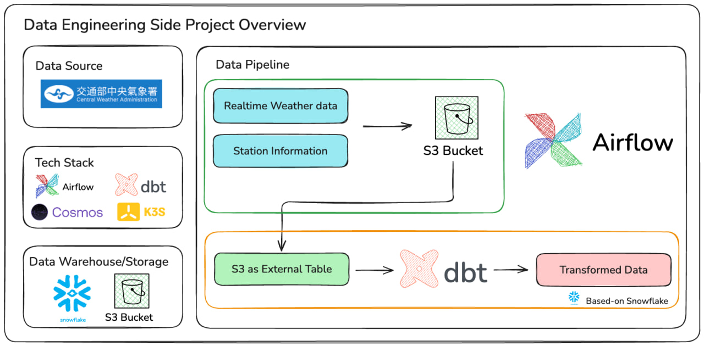
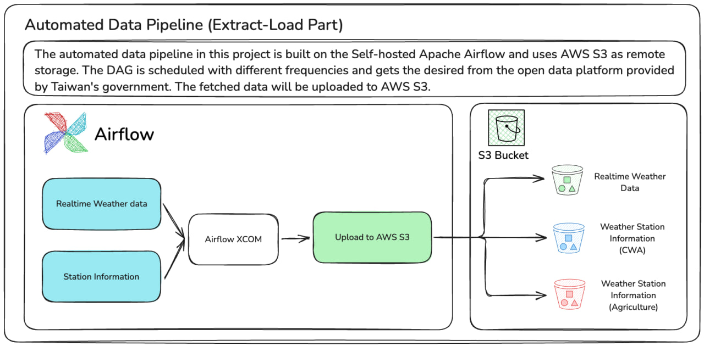
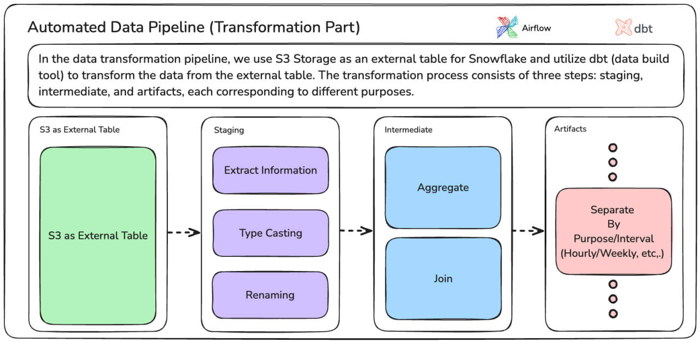

# weather_data_dbt

## Introduction

This is a side project to build an end-to-end automated data pipeline. We use weather data provided by the Taiwan government as the data source. The automated pipeline is powered by the Apache Airflow, which is a well known automation tool. The data downloaded by the Airflow task will be uploaded to the AWS S3 Storage. The AWS S3 has been configured as an external table of the Snowflake Data Warehouse.

> For Japanese version, please refer to: [Japanese Version](./multilingual_readme/readme_jp.md)

## Requirements

* `Airflow` >= `2.9.3`
* `dbt-core` == `1.8.5`
* `dbt-snowflake` == `1.8.3`
* `astronomer-cosmos` == `1.5.1`
* `boto3` == `1.34.90`

### Optional

* `Docker` >= `27.0.3`
* `k3s` == `v1.30.4+k3s1`

## Extract - Load Process

The automated data pipeline in this project is built on the Self-hosted Apache Airflow and uses AWS S3 as remote storage. The DAG is scheduled with different frequencies and gets the desired from the open data platform provided by Taiwan's government. The fetched data will be uploaded to AWS S3.

## Transformation Process

In the data transformation pipeline, we use S3 Storage as an external table for Snowflake and utilize dbt (data build tool) to transform the data from the external table. The transformation process consists of three steps: staging, intermediate, and artifacts, each corresponding to different purposes.

> For detail transformation and processing information, please refer to the auto-generated dbt document: [Web Page](https://davidho27941.github.io/weather_data_dbt/#!/overview)

## Future Plan

In the current design, we get the real-time data fetch by the HTTP connection directory, which is simple but may fail to get the data when the operator faces unexpected errors. The implementation of Kafka data streaming is a potential solution for fault toleration. 