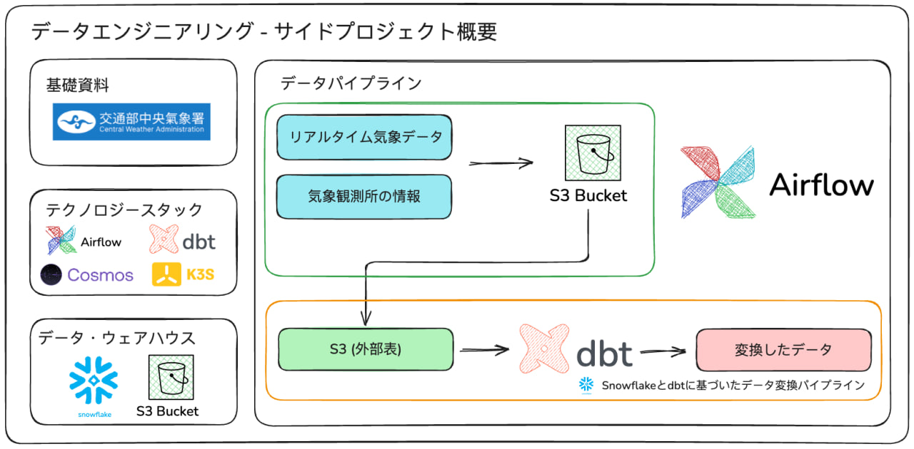
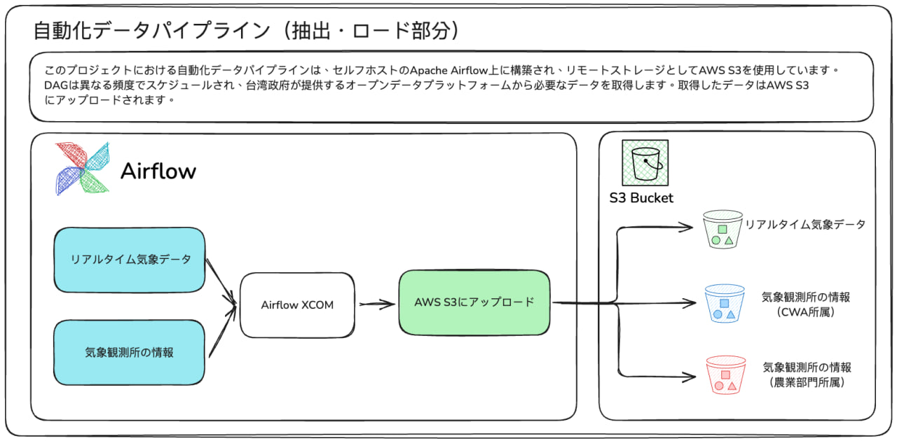
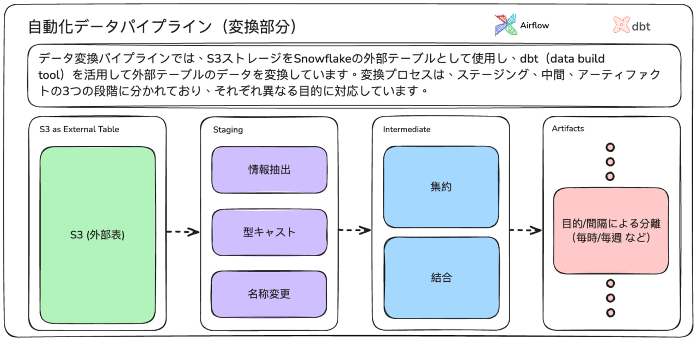

# weather_data_dbt

## イントロダクション
これは、エンドーツーエンドの自動データパイプラインを構築するサイドプロジェクトです。台湾政府が提供する天気データをデータソースとして使用しています。この自動パイプラインは、広く知られている自動化ツールであるApache Airflowによって駆動されています。Airflowタスクでダウンロードされたデータは、AWS S3ストレージにアップロードされ、さらなるデータ変換プロセスを受け、様々の最終結果に仕上がる。AWS S3は、Snowflakeデータウェアハウスの外部テーブルとして設定されています。

## 必要要件

* Airflow >= 2.9.3
* dbt-core == 1.8.5
* dbt-snowflake == 1.8.3
* astronomer-cosmos == 1.5.1
* boto3 == 1.34.90

### オプション
* Docker >= 27.0.3
* k3s == v1.30.4+k3s1

## 抽出・ロードプロセス

このプロジェクトにおける自動化データパイプラインは、セルフホストのApache Airflow上に構築され、リモートストレージとしてAWS S3を使用しています。DAGは異なる頻度でスケジュールされ、台湾政府が提供するオープンデータプラットフォームから必要なデータを取得します。取得したデータはAWS S3 にアップロードされます。

## 変換プロセス

データ変換パイプラインでは、S3ストレージをSnowflakeの外部テーブルとして使用し、dbt（data build tool）を活用して外部テーブルのデータを変換しています。変換プロセスは、ステージング、中間、アーティファクトの3つの段階に分かれており、それぞれ異なる目的に対応しています。

> 詳細な変換および処理情報については、自動生成されたdbtドキュメントを参照してください: [Web Page](https://davidho27941.github.io/weather_data_dbt/#!/overview)

## 将来の計画

現在の設計では、HTTP直接接続によるリアルタイムデータの取得を行っていますが、これはシンプルである一方で、オペレーターが予想されていないエラーに直面した際に、タスクが失敗する可能性があります。Kafkaデータストリーミングの実装は、故障許容性の向上に役立つと思われている。